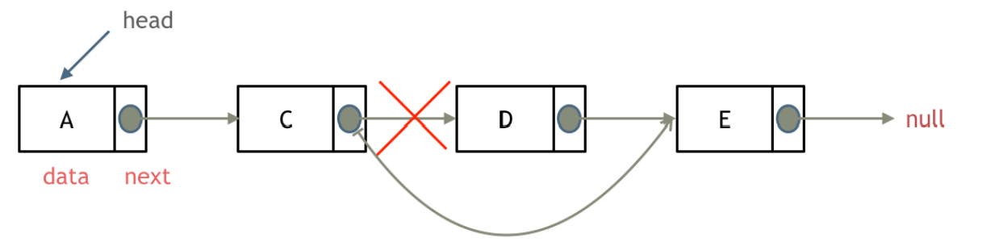
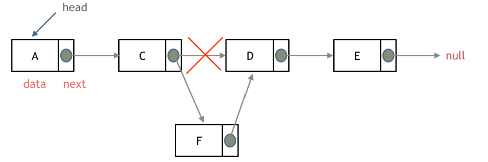

# 707. Design Linked List

## Problem Description

Implement the following functionalities in a linked list class:

- **get(index)**  
  Return the value of the node at the specified `index`.  
  If the index is invalid, return `-1`.

- **addAtHead(val)**  
  Add a node with value `val` before the first element of the linked list.  
  After insertion, the new node becomes the head of the list.

- **addAtTail(val)**  
  Append a node with value `val` to the end of the linked list.

- **addAtIndex(index, val)**  
  Add a node with value `val` before the node at the specified `index`.

  - If `index == length`, the node is appended to the tail.
  - If `index > length`, the node is **not inserted**.
  - If `index < 0`, the node is inserted at the head.

- **deleteAtIndex(index)**  
  Delete the node at the specified `index` if the index is valid.

## Example

```text
MyLinkedList linkedList = new MyLinkedList();

linkedList.addAtHead(1);
linkedList.addAtTail(3);
linkedList.addAtIndex(1, 2);   // The linked list becomes 1 -> 2 -> 3

linkedList.get(1);             // Returns 2

linkedList.deleteAtIndex(1);   // The linked list becomes 1 -> 3

linkedList.get(1);             // Returns 3
```

**LeetCode Link:** https://leetcode.com/problems/design-linked-list/

---

## Delete Linked List Node



## Add Linked List Node



This problem requires designing five linked list operations:

- Retrieve the value of the node at index `index`
- Insert a node at the head of the linked list
- Insert a node at the tail of the linked list
- Insert a node before the node at index `index`
- Delete the node at index `index`

---

### (Version 1) Singly Linked List Implementation

```python
class ListNode:
    def __init__(self, val=0, next=None):
        self.val = val
        self.next = next


class MyLinkedList:

    def __init__(self):
        self.dummy_head = ListNode()
        self.size = 0

    def get(self, index: int) -> int:
        if index < 0 or index >= self.size:
            return -1

        current = self.dummy_head.next
        for _ in range(index):
            current = current.next

        return current.val

    def addAtHead(self, val: int) -> None:
        self.dummy_head.next = ListNode(val, self.dummy_head.next)
        self.size += 1

    def addAtTail(self, val: int) -> None:
        current = self.dummy_head
        while current.next:
            current = current.next

        current.next = ListNode(val)
        self.size += 1

    def addAtIndex(self, index: int, val: int) -> None:
        if index < 0 or index > self.size:
            return

        current = self.dummy_head
        for _ in range(index):
            current = current.next

        current.next = ListNode(val, current.next)
        self.size += 1

    def deleteAtIndex(self, index: int) -> None:
        if index < 0 or index >= self.size:
            return

        current = self.dummy_head
        for _ in range(index):
            current = current.next

        current.next = current.next.next
        self.size -= 1


# Your MyLinkedList object will be instantiated and called as such:
# obj = MyLinkedList()
# param_1 = obj.get(index)
# obj.addAtHead(val)
# obj.addAtTail(val)
# obj.addAtIndex(index, val)
# obj.deleteAtIndex(index)
```

### (Version 2) Doubly Linked List Implementation

```python
class ListNode:
    def __init__(self, val=0, prev=None, next=None):
        self.val = val
        self.prev = prev
        self.next = next


class MyLinkedList:

    def __init__(self):
        self.head = None
        self.tail = None
        self.size = 0

    def get(self, index: int) -> int:
        if index < 0 or index >= self.size:
            return -1

        # Traverse from the closer end
        if index < self.size // 2:
            current = self.head
            for _ in range(index):
                current = current.next
        else:
            current = self.tail
            for _ in range(self.size - index - 1):
                current = current.prev

        return current.val

    def addAtHead(self, val: int) -> None:
        new_node = ListNode(val, None, self.head)

        if self.head:
            self.head.prev = new_node
        else:
            self.tail = new_node

        self.head = new_node
        self.size += 1

    def addAtTail(self, val: int) -> None:
        new_node = ListNode(val, self.tail, None)

        if self.tail:
            self.tail.next = new_node
        else:
            self.head = new_node

        self.tail = new_node
        self.size += 1

    def addAtIndex(self, index: int, val: int) -> None:
        if index < 0 or index > self.size:
            return

        if index == 0:
            self.addAtHead(val)
        elif index == self.size:
            self.addAtTail(val)
        else:
            # Traverse from the closer end
            if index < self.size // 2:
                current = self.head
                for _ in range(index - 1):
                    current = current.next
            else:
                current = self.tail
                for _ in range(self.size - index):
                    current = current.prev

            new_node = ListNode(val, current, current.next)

            current.next.prev = new_node
            current.next = new_node

            self.size += 1

    def deleteAtIndex(self, index: int) -> None:
        if index < 0 or index >= self.size:
            return

        if index == 0:
            self.head = self.head.next

            if self.head:
                self.head.prev = None
            else:
                self.tail = None

        elif index == self.size - 1:
            self.tail = self.tail.prev

            if self.tail:
                self.tail.next = None
            else:
                self.head = None

        else:
            # Traverse from the closer end
            if index < self.size // 2:
                current = self.head
                for _ in range(index):
                    current = current.next
            else:
                current = self.tail
                for _ in range(self.size - index - 1):
                    current = current.prev

            current.prev.next = current.next
            current.next.prev = current.prev

        self.size -= 1


# Your MyLinkedList object will be instantiated and called as such:
# obj = MyLinkedList()
# param_1 = obj.get(index)
# obj.addAtHead(val)
# obj.addAtTail(val)
# obj.addAtIndex(index, val)
# obj.deleteAtIndex(index)
```
